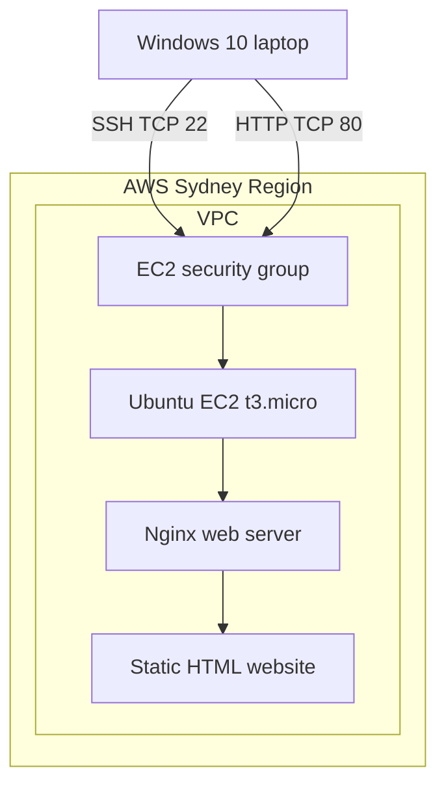
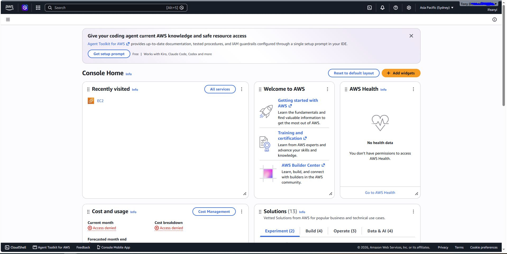

# AWS EC2 Linux Web Server

## Project Overview

I deployed my first cloud-hosted website using AWS EC2, Ubuntu Linux and Nginx. The project involved creating a virtual server, configuring network access, connecting through SSH and publishing a custom HTML webpage.

I also completed two troubleshooting exercises involving an Nginx service failure and an AWS security-group misconfiguration. Both incidents are documented in this repository.

## Technologies Used

- AWS EC2
- Ubuntu Linux
- Nginx
- AWS VPC and security groups
- SSH
- Git Bash on Windows 10
- Git and GitHub
- HTML

## Project Objectives

1. Deploy an Ubuntu Linux server on AWS EC2.
2. Connect securely to the server using SSH.
3. Install and manage the Nginx web server.
4. Publish a custom HTML webpage.
5. Configure and understand AWS security-group rules.
6. Troubleshoot application and network failures.
7. Document the deployment and troubleshooting process.

## Architecture

The website runs on an Ubuntu EC2 instance in the AWS Sydney Region.

Visitors access the website using the instance's public IPv4 address over HTTP on port 80. An AWS security group controls inbound traffic.

I administer the server remotely using Git Bash and SSH on port 22. SSH access is restricted to my public IP address.

Nginx serves the website's HTML content from `/var/www/html/index.html`.




## AWS Infrastructure Configuration

| Resource | Configuration |
|---|---|
| AWS Region | Asia Pacific (Sydney), ap-southeast-2 |
| EC2 instance type | t3.micro |
| Operating system | Ubuntu 24.04 LTS |
| Web server | Nginx |
| Application | Static HTML website |
| Remote administration | SSH using Git Bash |

The EC2 instance has a public IPv4 address, allowing
the website to be accessed from a web browser over HTTP.

AWS security-group rules control inbound access to
the instance.

## Deployment Procedure

### 1. Provision the EC2 instance

I launched one Ubuntu 24.04 LTS EC2 instance in the AWS Sydney Region using the t3.micro instance type.

I created an SSH key pair and configured the security group to permit SSH from my public IP and HTTP from the internet.

### 2. Connect to the instance

From Git Bash on Windows 10, I connected using:

```bash
ssh -i ~/.ssh/cloud-engineer-key.pem ubuntu@YOUR_PUBLIC_IP
```

The public IP address must be replaced with the actual EC2 public IPv4 address.

### 3. Install Nginx

```bash
sudo apt update
sudo apt install nginx -y
```

### 4. Verify the web server

```bash
sudo systemctl status nginx
curl -I http://localhost
```

The local HTTP test returned 200 OK.

### 5. Deploy the website

I created a custom HTML webpage in `/var/www/html/index.html` and tested it from my Windows browser using the instance's public IPv4 address.

### 6. Verify public access

I visited `http://YOUR_PUBLIC_IP` and confirmed that my custom website loaded successfully.

## Security Configuration

I configured an EC2 security group with two inbound rules:

| Protocol | Port | Source | Purpose |
|---|---|---|---|
| SSH | TCP 22 | My public IP address only | Remote administration |
| HTTP | TCP 80 | 0.0.0.0/0 | Public website access |

### SSH authentication

I used an SSH private key stored locally on my Windows computer. The private key is not committed to GitHub.

### Security decisions

- Restricted SSH access to my public IP address.
- Allowed inbound HTTP access for the public demonstration website.
- Used key-based SSH authentication.
- Did not expose database ports.

### Current limitations

The demonstration website currently uses unencrypted HTTP. HTTPS and a TLS certificate would be required for a production website.

The instance is manually configured. Future improvements will introduce infrastructure automation, additional monitoring and automated deployment.


## Troubleshooting and Incident Reports

I conducted two controlled failure simulations to develop my AWS troubleshooting skills.

### Incident 01: Nginx Service Failure

I deliberately stopped Nginx, investigated the service failure and successfully restored the website.

[Read Incident 01](docs/incident-01-nginx-service.md)

### Incident 02: AWS Security-Group Failure

I removed the inbound HTTP rule from my EC2 security group. Although Nginx continued working, the website became unreachable from my Windows browser. I restored the rule and confirmed recovery.

[Read Incident 02](docs/incident-02-security-group.md)

## Project Screenshots



## Cost Management and Cleanup

I created a USD $5 monthly AWS budget to monitor the costs associated with my cloud-learning environment.

I used a small EC2 t3.micro instance for this project.

### Stopping the instance

When taking a break, I stop the EC2 instance through the AWS Management Console to avoid unnecessary instance-compute charges.

Stopping an EBS-backed instance preserves its root volume and installed software. Storage and certain other resources may continue to incur charges.

The automatically assigned public IPv4 address may change after the instance is stopped and restarted.

### Final cleanup

Once the project is complete and all evidence has been captured, I will:

1. Terminate the temporary EC2 instance.
2. Check for remaining EBS volumes and snapshots.
3. Check for unused Elastic IP addresses and other billable resources.
4. Review the AWS Billing dashboard.
5. Confirm that no unnecessary lab resources remain.

The AWS budget provides spending alerts but does not automatically cap charges.